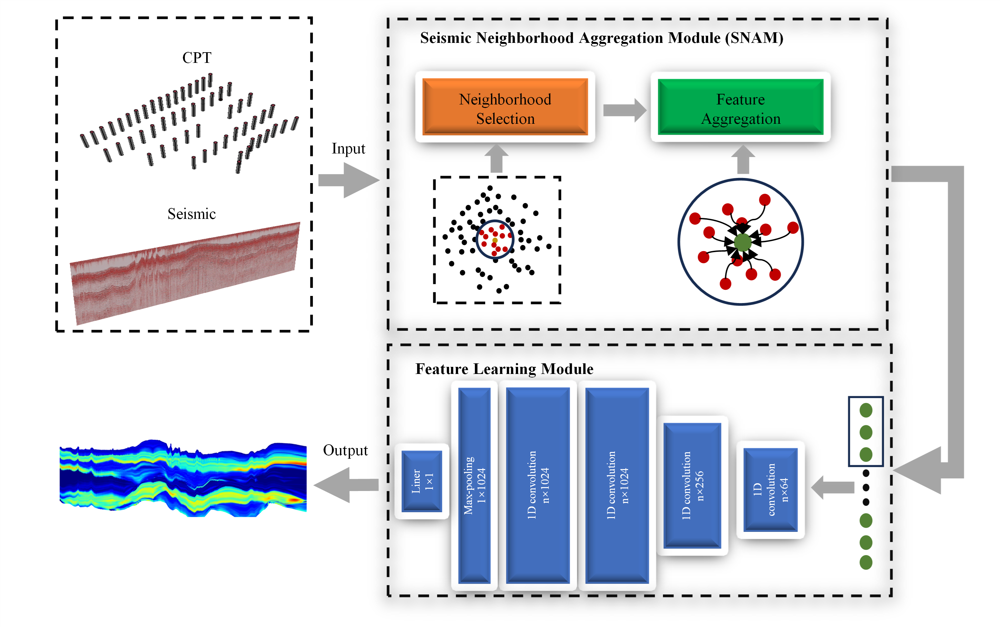
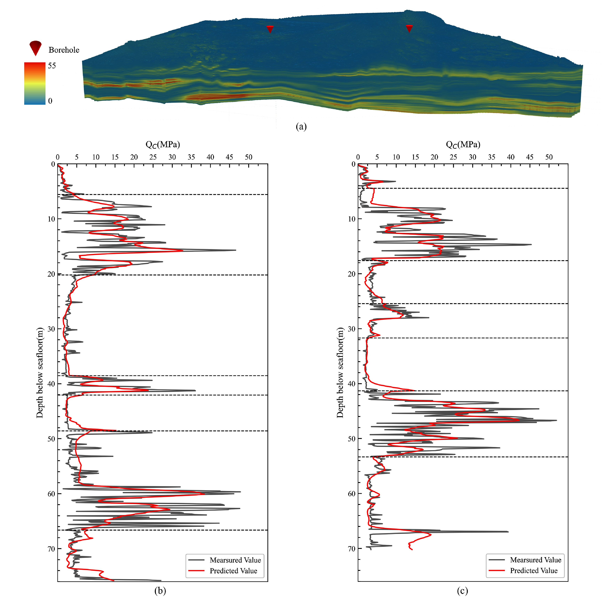
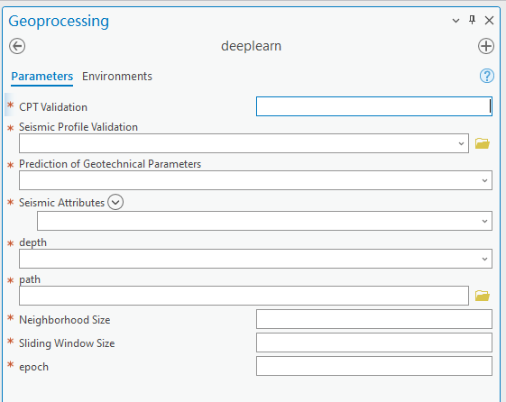

# A seismic integrated deep learning approach for prediction of off-shore wind site Cone Penetration Test Data
This is a PyTorch implementation of PointMetaBase proposed by our paper .

**Abstract**: Cone Penetration Test (CPT) data obtained from boreholes are essential for the site selection of offshore wind farms. However, the sparse distribution of boreholes limits the amount of available data, making accurate CPT data prediction a significant challenge. Additionally, the high cost of drilling technology exacerbates this issue. To address these challenges, this study integrates 3D seismic data and proposes a deep learning model that incorporates the attributes of neighborhood seismic images. Seismic and CPT data are fed into a Seismic Neighborhood Aggregation Module (SNAM) for neighborhood selection and feature aggregation training. The trained model is then used to predict CPT data. The results from multiple experimental datasets show that the predicted values closely match the actual measurements and effectively capture changes in geotechnical properties at stratigraphic boundaries. Compared to commonly used models such as Support Vector Machines (SVM), Random Forests (RF), and Artificial Neural Networks (ANN), this method achieves the smallest error and provides more stable predictions. This advantage is particularly pronounced in regions with abrupt lithological changes within the same stratum. Furthermore, the model can accurately predict CPT data for deeper strata, significantly expanding its potential applications.

Figure 1:Fig.1. Deep Learning Model for CPT Data Prediction. The CPT and seismic data are utilized as input to the SNAM, which comprises two components: Neighborhood Selection and Feature Aggregation. In SNAM, the green dots represent the central points for feature aggregation, while the red dots denote the neighboring points. In the Feature Learning Module, the green dots indicate the aggregated CPT borehole points, and the black rectangles represent the sliding windows.
 
 

Figure 2:  CPT Data Prediction Results. Using cone resistance (QC) as an example. (a) Voxel interpolation results of the QC. The red cone-shaped markers indicate CPT borehole locations used for validation. (b), (c) Validation curves at the CPT borehole locations, with dashed lines indicating stratigraphic boundaries.
 
 
## Install

Our toolbox runs on ArcGIS Pro 3.2 with Python 3.8 and PyTorch 1.13.Please install ArcGIS Pro and use conda to install PyTorch 1.13.Please refer the [arcgis online help](https://pro.arcgis.com/en/pro-app/latest/help/projects/connect-to-a-toolbox.htm) to install the toolbox to arcgis pro

## source code
Please refer the [arcgis online help](https://pro.arcgis.com/en/pro-app/3.3/arcpy/geoprocessing_and_python/editing-script-tool-code.html) to view the sorce code.

## Additional Tools
Additional tools including import geology dataset, such as sesmic data(sgy fomart), CPT holes data(office excel format), stratigraphic horizon (ascii grid data), visualization are also provided. A instal.exe provide to intsall [these additional tools](tools/install.exe).
## Model parameters
As shown in Figure 3, open the toolbox in ArcGIS Pro.
 
CPT Validation: Enter the CPT borehole number to be validated.
 
Seismic Profile Validation: Enter the seismic profile to be predicted.
 
Prediction of Geotechnical Parameters: Select the geotechnical parameter to be predicted, such as cone resistance (QC).
 
Seismic Attributes: Select the seismic attributes to be used, such as "Amplitude," "Envelope," "Phase," and "Frequency."
 
Depth: Choose between Absolute Depth or Normalized Depth.
 
Path: Enter the output path.
 
Neighborhood Size and Sliding Window Size: Enter the respective parameters.

    

Figure 3:  Toolbox interface

